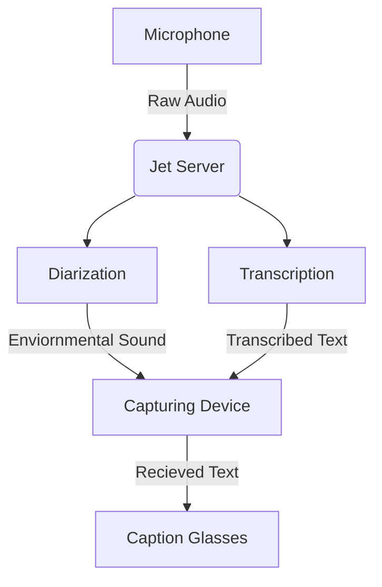

Captioning Heads Up Display Glasses (or CHUD Glasses) is a project started by in 2025. The goal is to create glasses that will listen to their surroundings and display what people are saying on the inside of the glasses.

## Captioning Process
Below is a flowchart of the Captioning process

